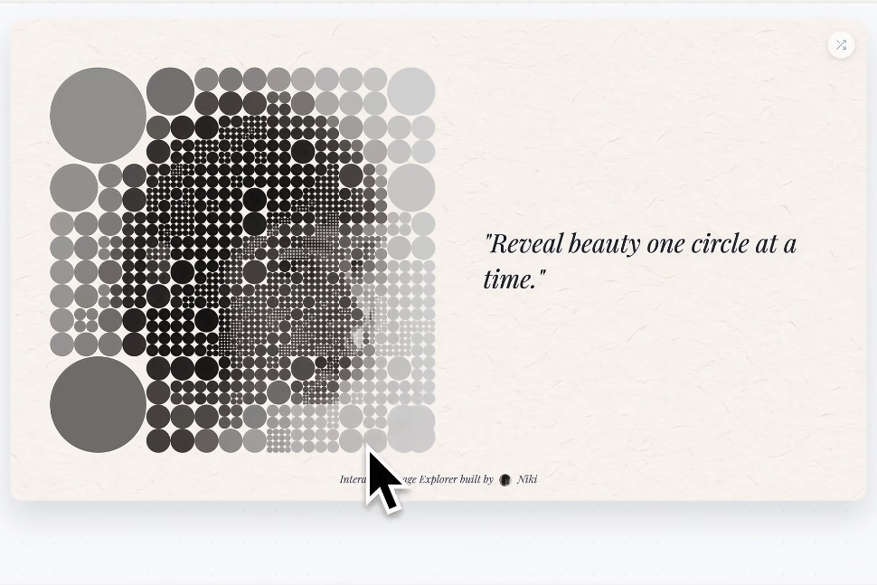

# 9103-Creative-coding-major-project

## Inspiration
Our project was inspired by Gustav Klimt's artworks, particularly Portrait of Adele Bloch-Bauer I and The Kiss. We were interested in how Klimt's use of gold, mosaic-like surfaces, and decorative patterns could be translated into an interactive digital experience.

We also drew inspiration from generative art practices that reconstruct images through repeated geometric elements. These influences led us to create a mosaic system where individual circles act as visual building blocks that gradually transform one artwork into another through interaction, sound, and time.

- **Inspiration Source 1**

 
 
[Circle-based Mapping](http://xhslink.com/o/1wdzVf95Whq)

- **Inspiration Source 2**

 
 
[Liquid Fabric](http://xhslink.com/o/AtaZVKtxsUq)

---

## Techniques

### Image Mosaic (PerlinNoise)
- A double for loop divides the canvas into a grid, creating one tile object per cell via `tiles.push({...})`.

- `img.get(x, y)` samples pixel colour from both paintings, storing `colourAdele` and `colourKiss` in each tile.

- `Noise()` adds organic variation so the grid feels hand-crafted rather than mechanical.

- `flipProgress (0–1)` is the shared property all four mechanics use to blend between the two paintings via `lerp()`.

- `calculateImageDrawProps()` keeps the image correctly fitted at any window size; `windowResized()` rebuilds the grid automatically.

### Time-Based Mechanic
- `frameCount` drives a repeating cycle: 6 seconds idle → wave transition → 6 seconds idle.

- The pattern `elapsed % interval === tileIndex` activates one column (or row) strip per frame, creating a rolling left-to-right or top-to-bottom wipe.

- Direction alternates each cycle between column wave and row wave using `!useColumns`.

- `lerp(flipProgress, target, 0.95)` gives each strip a fast, smooth colour snap.
`drawCountdown()` shows a live second counter with `push()` / `pop()` to isolate text styling.

### User Input Mechanic
- dist(`mouseX`, `mouseY`, `cx`, `cy`) finds tiles within HOVER_RADIUS (80px) of the cursor each frame.

- Tiles inside the radius expand toward `baseSize * BULGE_SCALE` via `lerp()`, creating a ripple bulge effect.

- `map(d, 0, HOVER_RADIUS, 1, 0)` produces a smooth proximity falloff so tiles closest to the cursor bulge most.

- Setting `tile.flipped = true` triggers `updateFlipProgress()`, revealing The Kiss under the cursor.

### Audio Mechanic
- `fft.analyze()` returns 128 frequency-band energy values each frame; each tile maps to one frequency bin.

- Energy values scale displaySize upward via `lerp()`, making circles pulse with the music.

- `mouseMoved()` maps mouse Y to volume and mouse X to stereo pan via `song.setVolume()` and `song.pan()`.

- A `createButton() Play / Pause button` lets the viewer start or stop the music at any time.

## Mechanic Ownership

### Yuanxin Yu - PerlinNoise
I was responsible for the basic visual system of the project. The most basic mosaic grid is directly set up, and circles on the canvas are drawn through color sampling. The tile arrays created within this mechanism and the FlipProgress system act as shared data structures that all other mechanisms (time-based, audio, and user input) can read and write to.

### Xiaorong Dang – TimeBased
Xiaorong Dang: There is a time-driven mosaic transition between two artworks. Pausing every 6 seconds, waves sweep across the canvas column by column (or row by row), flipping all the tiles to reveal the other artwork within 3 seconds. Each cycle alternates between left-to-right and top-to-bottom directions. This cycle repeats infinitely.

### Liqi Lu – UserInput
Responsible for the interactive mouse-based behaviour of the mosaic. This mechanic uses distance calculations and interpolation to create a ripple effect when the cursor moves across the artwork.

Hovering over a tile also activates its flip state, allowing interaction to initiate the artwork transition process.

### Carol Tao – Audio
Handles the sound layer of the project. A background music track is loaded and controlled through a Play/Pause button. Mouse movement adjusts the audio experience: moving vertically changes the volume, while horizontal movement shifts the stereo pan. FFT analysis is used subtly to make tiles gently pulse with the music’s energy, adding rhythmic motion without interfering with other mechanics.

## AI Acknowledgement
We used AI (mainly Claude) as a support tool to help integrate my audio mechanic with the other team members’ modules. At first, my audio code worked on its own but failed when combined with the PerlinNoise, TimeBased, and UserInput systems. AI helped me identify the cause of the conflict and suggested adjustments to the order of function calls and initialisation, which resolved the issue and allowed all mechanics to run together smoothly. AI also assisted in simplifying parts of my script, making the final Audio.js cleaner and easier to maintain.
Claude is used to assist with generating and debugging code in perlinNoise.js. Claude helped build the buildTiles() function and resolved color mode conflicts between HSB and RGB.

## External References
Circle size based on halftone brightness - A technique for controlling circle size using pixel brightness inspired by halftone printing: 
https://editor.p5js.org/chrsgrbr/sketches/mLNDLCYys
img.resize() is used to normalize two images to the same dimensions before sampling. Reference: 
https://p5js.org/reference/p5.Image/resize/
windowResized() — Used to rebuild the tile grid when the browser window changes size. Reference: 
https://p5js.org/reference/p5/windowResized/
Audio Download: Sterio18. (2019). Soft Piano Loop [Sound file]. Freesound. Reference: 
https://freesound.org/people/Sterio18/sounds/472903/

## Interaction Instructions

1. Click **Play / Pause Music**.
2. Move the mouse over the artwork to change the size of the circle mosaic.
3. Move the mouse vertically to control volume.
4. Move the mouse horizontally to control stereo pan.
5. Circular mosaic beats to music